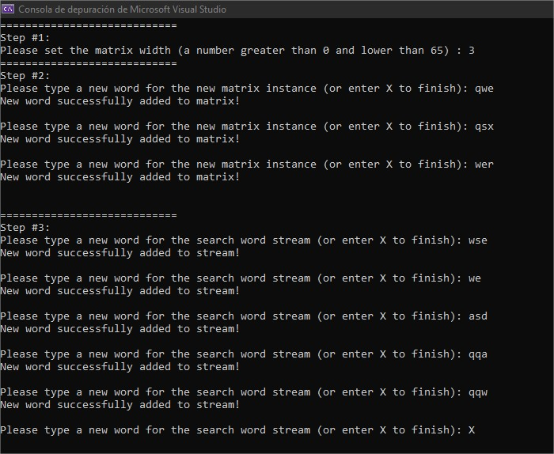

# QU_Beyond_Challenge

**Selected language:**

- .Net Core 3.1 (C#)

# Overview

It's requested to build a solution for a "Word Finder" software wich, from a given stream of words would be capable, first of all, of building a square matrix from stream word's characters and, secondly, retieve the top N (10) words from another stream found in the matrix (vertically and horizontally directions) ranking those words by findings quantity.

**The resulting solutions looks like this:**

...As you can see in the images above, the solution is based on a Console Application that propmts the user first to type in the size (width) of the matrix (that will be the same expected length of the words for building de matrix), then the words for the matrix creation, the total qty of words must be the same as the declared matrix width in order to build a square object however, it's just a "business" validation in the presentation layer and if it's removed, the process will work as expected too just with a rectangular "matrix" instead of a square one.

# Highligths of solution's technical and logical approach:

- First of all you'll find in the solution a sort of N-Layer distribution in the code to help the responsibility separation as shown in the following image:

- Then, in the other hand, regarding logical concerns about the proposed solution the idea here is to buils a char bidimensional array ( char[.] ) to act like our requested matrix, so since the user types in the console the words to build this char array, we can simply collect those words in a list of strings to have at the same time the stream for the matrix's chars and the first part of our "reference" word collection to search into.

Then since we are asked to search the given words inside the matrix horzontally and vertically then we need in our previously created "collection" of matrix words the strings built from the vertical characters, so once the matrix is built, **we can read it column by column to build the "vertical words" and add them to our list**

Finally, we will have our workaround (after cleaning up the input stream to get rid of possible repeated strings) to get the Top N (10) words from de input stream found in the collection built from the matrix using a couple of simple linq functions.

**And last but not least, the solution has an example of Unit Testing where build matrix functionality is tested using xUnit as shown below:**

